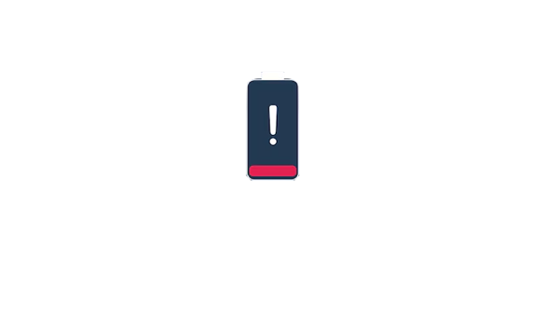
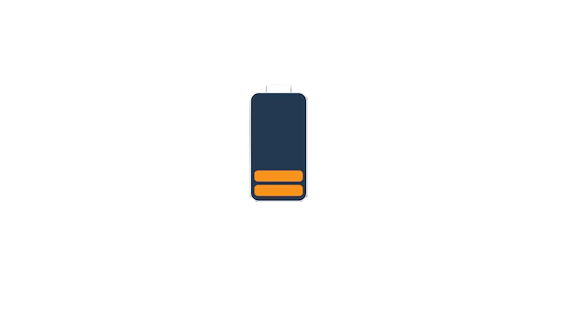
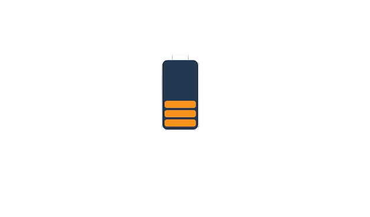
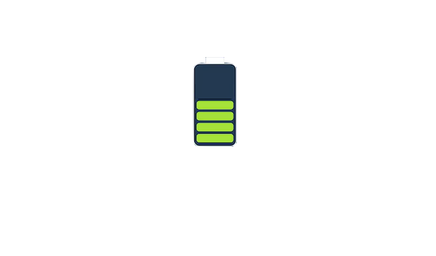
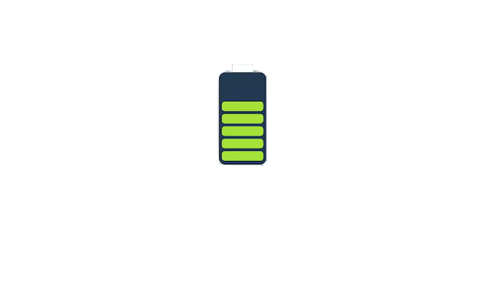
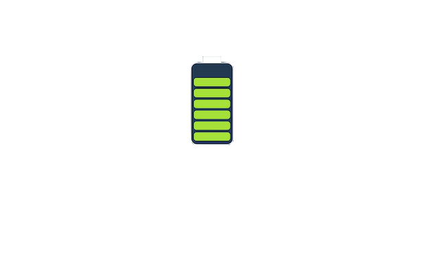
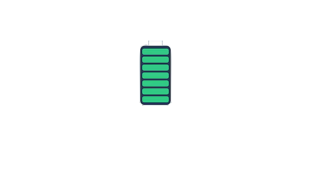
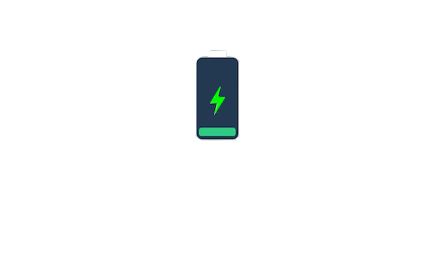
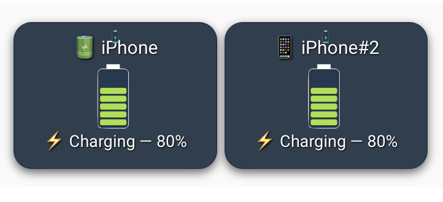
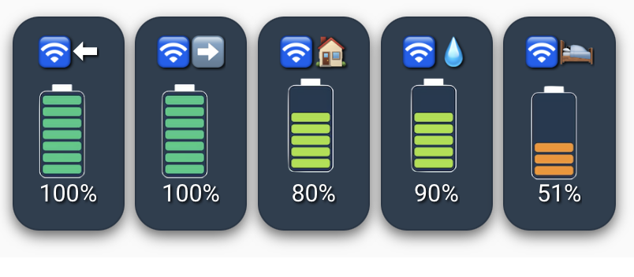

# 🔋 Lovelace Battery Level Display for Home Assistant

Display clean and dynamic battery visuals for any sensor or device in Home Assistant.

- 📊 Battery percentages are **mapped to 8 discrete levels**: 0%, 5%, 15%, 35%, 50%, 75%, 90%, 100%  
- ⚡ A dedicated **charging overlay icon** is shown when the battery is charging  
- 🧱 Built using `custom:button-card` and `custom:layout-card` for flexible UI layouts  
- 🖼️ Icons are stored locally in `/config/www/battery/`  
- 📱 Supports **2, 5, or more device layouts** for phones, motion sensors, and remotes

---

## 🔧 Installation

### 1. Upload Battery Icons

Place the following image files into your Home Assistant `/config/www/battery/` directory:

- `battery_0.png`  
- `battery_5.png`  
- `battery_15.png`  
- `battery_35.png`  
- `battery_50.png`  
- `battery_75.png`  
- `battery_90.png`  
- `battery_100.png`  
- `battery_charging.png` ⬅️ _(used as an overlay when the device is charging)_

> 📂 If the `www` folder doesn’t exist yet, create it under `/config/`.

---

## 🖼️ Battery Icon Previews

<table>
  <tr>
    <td width="150" height="150" align="center"></td>
    <td width="150" height="150" align="center"></td>
    <td width="150" height="150" align="center"></td>
    <td width="150" height="150" align="center"></td>
  </tr>
  <tr>
    <td align="center"><strong>0%</strong></td>
    <td align="center"><strong>5%</strong></td>
    <td align="center"><strong>15%</strong></td>
    <td align="center"><strong>35%</strong></td>
  </tr>
  <tr>
    <td width="150" height="150" align="center"></td>
    <td width="150" height="150" align="center"></td>
    <td width="150" height="150" align="center"></td>
    <td width="150" height="150" align="center"></td>
  </tr>
  <tr>
    <td align="center"><strong>50%</strong></td>
    <td align="center"><strong>75%</strong></td>
    <td align="center"><strong>90%</strong></td>
    <td align="center"><strong>100%</strong></td>
  </tr>
  <tr>
    <td colspan="4" align="center">
       
      <strong>Charging Overlay</strong>
    </td>
  </tr>
</table>

---

## 📷 Preview: 2 Devices

---

---

## 📷 Preview: 2 Devices

