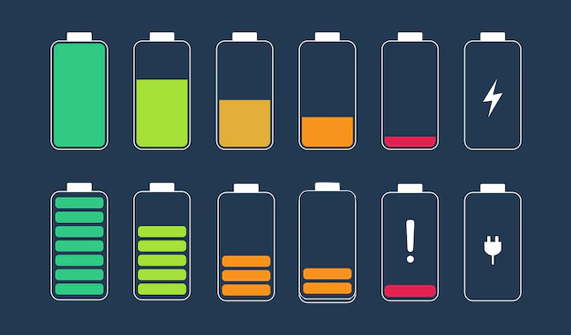

# 🔋 Lovelace Battery Level Display for Home Assistant

This project provides a sleek, visual representation of battery levels (e.g., iPhones or other devices) directly within your Home Assistant dashboard.

It includes:

- 📊 A **template sensor** that maps raw battery values to discrete levels (0, 5, 15, 35, 75, 100)
- 🧱 A **Lovelace card layout** using `custom:button-card` and `custom:layout-card`
- 🖼️ Custom battery icons stored locally (`/config/www/battery/`) for accurate display
- 📱 Support for multiple devices (examples include 2 and 4-device layouts)

---

## 🔧 Installation

### 1. Upload Battery Icons

Place the following PNG files into `/config/www/battery/` in your Home Assistant setup:

- `battery_0.png`
- `battery_5.png`
- `battery_15.png`
- `battery_35.png`
- `battery_75.png`
- `battery_100.png`

These represent battery level thresholds and are dynamically selected based on device battery state.

### 2. Add Lovelace YAML

Two example Lovelace configurations are provided:

- `ui-lovelace_2_devices.yaml`: For displaying **2 devices**
- `ui-lovelace_5_devices.yaml`: For displaying **5 devices**

You can copy the relevant YAML code into a `manual` dashboard or use it as a card configuration.

---

## 📷 Preview: Dual Batteries

Here’s what the 2-device battery display looks like:

---

## 📷 Preview: Five Devices

Here’s what the 4-device battery layout looks like:

---

## 📷 Additional Example

Alternate visual layout preview:

