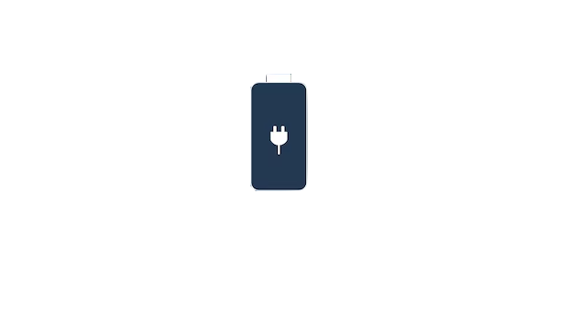
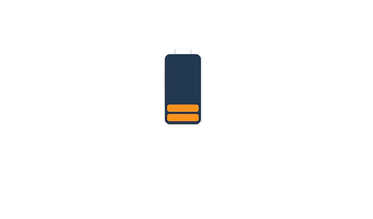
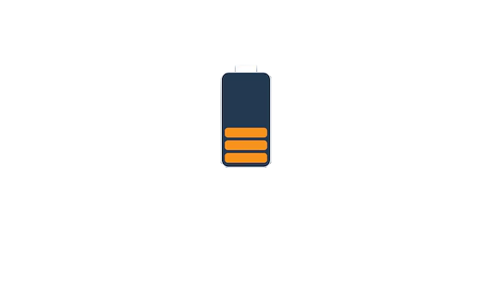

# 🔋 Lovelace Battery Level Display for Home Assistant

- 📊 Template sensor mapping raw battery levels to: 0, 5, 15, 35, 50, 75, 90, 100  
- 🧱 Lovelace card layout using `custom:button-card` and `custom:layout-card`  
- 🖼️ Battery icons in `/config/www/battery/`  
- 📱 Multi-device display (2 or 5 devices)  

---

## 🔧 Installation

### 1. Upload Battery Icons

Put the following files in `/config/www/battery/`:

- `battery_0.png`  
- `battery_5.png`  
- `battery_15.png`  
- `battery_35.png`  
- `battery_50.png`  
- `battery_75.png`  
- `battery_90.png`  
- `battery_100.png`  

---

## 🖼️ Battery Icon Previews

<table>
  <tr>
    <td width="150" height="150" align="center"></td>
    <td width="150" height="150" align="center"></td>
    <td width="150" height="150" align="center"></td>
    <td width="150" height="150" align="center"></td>
  </tr>
  <tr>
    <td align="center"><strong>0%</strong></td>
    <td align="center"><strong>5%</strong></td>
    <td align="center"><strong>15%</strong></td>
    <td align="center"><strong>35%</strong></td>
  </tr>
  <tr>
    <td width="150" height="150" align="center"></td>
    <td width="150" height="150" align="center"></td>
    <td width="150" height="150" align="center"></td>
    <td width="150" height="150" align="center"></td>
  </tr>
  <tr>
    <td align="center"><strong>50%</strong></td>
    <td align="center"><strong>75%</strong></td>
    <td align="center"><strong>90%</strong></td>
    <td align="center"><strong>100%</strong></td>
  </tr>
</table>

---

## 📷 Preview: 2 Devices

